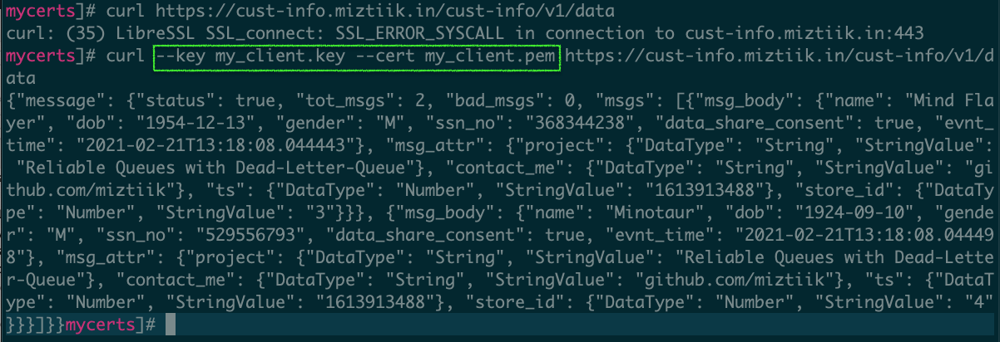

# API Design Best Practice: Mutual TLS authentication for APIs

Mystique Unicorn App is a building new microservice. Their developers are looking for a way to validate the incoming requests are coming from trusted sources and deny invoking the backend systems if the requests are from un-trusted sources. This will have the benefit of reducing cost as well as improving the performance of the backend components. The team is looking for your help to achieve this. Can you help them?


## 🎯 Solutions

TLS is the successor to SSL and it’s an excellent standard with many features. TLS guarantees the identity of the server to the client and provides a two-way encrypted channel between the server and client. Mutual TLS (mTLS) authentication ensures that traffic is both secure and trusted in both directions between a client and server. 

By default, the TLS protocol only requires a server to authenticate itself to the client. The authentication of the client to the server is managed by the application layer. The TLS protocol also offers the ability for the server to request that the client send an X.509 certificate to prove its identity. This is called _mutual TLS (mTLS)_ as both parties are authenticated via certificates with TLS.


To use mutual TLS with API Gateway, you upload a CA public key certificate bundle as an object containing public or private/self-signed CA certs. This is used for validation of client certificates. All existing API authorization options are available for use with mTLS authentication.


In this demo, We will build a simple API that will provides us customer data. We will later add mutual TLS authentication to our API using private certificates. Although we can use AWS Private CA, due to cost constraints we will use a private CA generated from our laptop/dev environment.

In this article, we will build an architecture, similar to the one shown above. We will start backwards so that all the dependencies are satisfied.

1.  ## 🧰 Prerequisites

    This demo, instructions, scripts and cloudformation template is designed to be run in `us-east-1`. With few modifications you can try it out in other regions as well(_Not covered here_).

    - 🛠 AWS CLI Installed & Configured - [Get help here](https://youtu.be/TPyyfmQte0U)
    - 🛠 AWS CDK Installed & Configured - [Get help here](https://www.youtube.com/watch?v=MKwxpszw0Rc)
    - 🛠 Python Packages, _Change the below commands to suit your OS, the following is written for amzn linux 2_
      - Python3 - `yum install -y python3`
      - Python Pip - `yum install -y python-pip`
      - Virtualenv - `pip3 install virtualenv`

1.  ## ⚙️ Setting up the environment

    - Get the application code

      ```bash
      git clone https://github.com/miztiik/serverless-api-mutual-tls
      cd serverless-api-mutual-tls
      ```

1.  ## 🚀 Prepare the dev environment to run AWS CDK

    We will use `cdk` to make our deployments easier. Lets go ahead and install the necessary components.

    ```bash
    # You should have npm pre-installed
    # If you DONT have cdk installed
    npm install -g aws-cdk

    # Make sure you in root directory
    python3 -m venv .venv
    source .venv/bin/activate
    pip3 install -r requirements.txt
    ```

    The very first time you deploy an AWS CDK app into an environment _(account/region)_, you’ll need to install a `bootstrap stack`, Otherwise just go ahead and deploy using `cdk deploy`.

    ```bash
    cdk bootstrap
    cdk ls
    # Follow on screen prompts
    ```

    You should see an output of the available stacks,

    ```bash
    serverless-api-mutual-tls
    ```

1.  ## 🚀 Deploying the application

    Let us walk through each of the stacks,

    - **Stack: serverless-api-mutual-tls**

      This stack creates a simple api that returns customer info served by a lambda function.

      Initiate the deployment with the following command,

      ```bash
      cdk deploy serverless-api-mutual-tls-producer-stack
      ```
      After successfully deploying the stack, Check the `Outputs` section of the stack. You will find the `CustomerInfoDataProducer` lambda function. We will invoke this function later during our testing phase.

      As of now the deployment does not have any authentication. If you access the API url using a browser or curl `CustomerInfoProducerApi` you will get an response as shown below,

      ```sh
      curl https://rrfxw7fvnh.execute-api.us-east-1.amazonaws.com/miztiik-cust-info-v1/cust-info/v1/data
      ```
      The response should be something like,

      ```json
      {
        "message": {
          "status": true,
          "tot_msgs": 2,
          "bad_msgs": 0,
          "msgs": [
            {
              "msg_body": {
                "name": "Beholder",
                "dob": "1997-03-26",
                "gender": "F",
                "ssn_no": "506762974",
                "data_share_consent": false,
                "evnt_time": "2021-02-21T10:38:44.012462"
              },
              "msg_attr": {
                "project": {
                  "DataType": "String",
                  "StringValue": "API Design Best Practice: Mutual TLS authentication for APIs"
                },
                "contact_me": {
                  "DataType": "String",
                  "StringValue": "github.com/miztiik"
                },
                "ts": {
                  "DataType": "Number",
                  "StringValue": "1613903924"
                },
                "store_id": {
                  "DataType": "Number",
                  "StringValue": "4"
                }
              }
            }
          ]
        }
      }
      ```


1.  ## 🔬 Testing the solution

    Before we go ahead and start testing the solution, We need to few more actions to be completed
     that cannot be done easily through automation.
    - A custom domain for configured and working `Route 53`<sup>[1]</sup> and preferably `AWS Certificate Manager`<sup>[2]</sup> configured for that domain
    - Set up a custom domain name in API Gateway<sup>[3]</sup>
      - We will setup mutual TLS on this domain, once we have our certs created.
 
    
    1. **Start Kinesis Analytics Application**:
      
      To configure mutual TLS, you first need to create the private certificate authority and client certificates. You will also need the public keys of the root certificate authority and any intermediate certificate authorities. These must be uploaded to API Gateway to authenticate certificates properly using mutual TLS. This example uses `OpenSSL` to create the certificate authority and client certificate.
      
      - Create the private certificate authority (CA) private and public keys:

        ```sh
        openssl genrsa -out RootCA.key 4096
        openssl req -new -x509 -days 36500 -key RootCA.key -out RootCA.pem
        ```
        

      - Provide the requested inputs for the root certificate authority’s subject name, locality, organization, and organizational unit properties. Choose your _own values_ for these prompts to customize your root CA
      
      - Once the CA certificates are created, you create the client certificate for use with authentication.
      - Create client certificate private key and certificate signing request (CSR):
        
        ```sh
        openssl genrsa -out my_client.key 2048
        openssl req -new -key my_client.key -out my_client.csr
        ```
      - Enter the client’s subject name, locality, organization, and organizational unit properties of the client certificate. Keep the optional password challenge empty default.OpenSSL options
        

      - Sign the newly created client cert by using your certificate authority you previously created:

        ```sh
        openssl x509 -req -in my_client.csr -CA RootCA.pem -CAkey RootCA.key -set_serial 01 -out my_client.pem -days 36500 -sha256
        ```
        

      - You now have a minimum of five files in your directory (there are additional files if you are also using an intermediate CA):
        - RootCA.key (root CA private key)
        - RootCA.pem (root CA public key)
        - my_client.csr (client certificate signing request)
        - my_client.key (client certificate private key)
        - my_client.pem (client certificate public key)

      - Prepare a `PEM`-encoded trust store file for all certificate authority public keys you want to use with mutual TLS:
        - Copy the existing root CA public key to a new truststore.pem file name for further clarity on which file is being used by API Gateway as the trust store:

          ```sh
          cp RootCA.pem truststore.pem
          ```

      - Upload the trust store file to an Amazon S3 bucket in the same AWS account as our API Gateway API. Create an S3 bucket and upload the CA bundle file:
          ```sh
          YOUR_BKT_NAME="my-pvt-ca-trust-store-bkt-0099"
          aws s3 mb s3://${YOUR_BKT_NAME} --region us-east-1
          aws s3 cp truststore.pem s3://${YOUR_BKT_NAME}/truststore.pem
          ```

        


    1. **Enabling mutual TLS on Custom Domain Name**:

       After uploading the new truststore CA bundle file, enable mutual TLS on the API Gateway custom domain name.
       - Browse to the API Gateway console and choose **Custom domain names**

        
       - Before changing settings, test a custom domain name with an API mapping to ensure that the API works without mutual TLS using curl. If your custom domain name and API configuration are correct, you should receive a response and HTTP status code of 200. 
       - After validation, enable mutual TLS for additional protection. Choose *Edit* to update the custom domain name configuration:

        
      - Enable the **Mutual TLS authentication** option and enter the path of the truststore PEM file, stored in an S3 bucket. You can optionally provide an S3 object version identifier to reference a specific version of the truststore CA bundle object:
        

      - Choose *Save* to enable mutual TLS for all APIs that the custom domain name maps to. _Wait_ for the custom domain status to show **Available**, indicating that the mutual TLS change is successfully deployed.
      
      - Test the HTTP request again using curl with the same custom domain name and without modifying the request. The request is now _forbidden_ as the call cannot be properly authenticated with mutual TLS.
        

      You can observe that the request is now properly authenticated and returns successfully.

1.  ## 📒 Conclusion

    Here we have demonstrated how to use private certificates to authenticate calls to our API using mutual TLS authentication. You can extend this further by enriching the authorization of the request using Cognito<sup>[6]</sup>.

1.  ## 🧹 CleanUp

    If you want to destroy all the resources created by the stack, Execute the below command to delete the stack, or _you can delete the stack from console as well_

    - Resources created during [Deploying The Application](#-deploying-the-application)
    - Delete CloudWatch Lambda LogGroups
    - _Any other custom resources, you have created for this demo_

    ```bash
    # Delete from cdk
    cdk destroy

    # Follow any on-screen prompts

    # Delete the CF Stack, If you used cloudformation to deploy the stack.
    aws cloudformation delete-stack \
      --stack-name "MiztiikAutomationStack" \
      --region "${AWS_REGION}"
    ```

    This is not an exhaustive list, please carry out other necessary steps as maybe applicable to your needs.

## 📌 Who is using this

This repository aims to show how to use mutual TLS for authenticating api requests to new developers, Solution Architects & Ops Engineers in AWS. Based on that knowledge these Udemy [course #1][103], [course #2][102] helps you build complete architecture in AWS.

### 💡 Help/Suggestions or 🐛 Bugs

Thank you for your interest in contributing to our project. Whether it is a bug report, new feature, correction, or additional documentation or solutions, we greatly value feedback and contributions from our community. [Start here](/issues)

### 👋 Buy me a coffee

[](https://ko-fi.com/Q5Q41QDGK) Buy me a [coffee ☕][900].

### 📚 References

1. [Docs: AWS Route 53 - Creating a public hosted zone][1]

1. [Docs: AWS ACM - Requesting a Public Certificate][2]

1. [Docs: AWS API Gateway - Setting up a regional custom domain name][3]

1. [Docs: AWS API Gateway - Call your API with custom domain names][4]

1. [Docs: AWS API Gateway - Disable default API for HTTP endpoints][5]

1. [Blog: Miztiik Automation Serverless API Authorizer][6]


### 🏷️ Metadata


**Level**: 300

[1]: https://docs.aws.amazon.com/Route53/latest/DeveloperGuide/CreatingHostedZone.html
[2]: https://docs.aws.amazon.com/acm/latest/userguide/gs-acm-request-public.html
[3]: https://docs.aws.amazon.com/apigateway/latest/developerguide/apigateway-regional-api-custom-domain-create.html
[4]: https://docs.aws.amazon.com/apigateway/latest/developerguide/how-to-edge-optimized-custom-domain-name.html#how-to-custom-domains-call-api-with-sni
[5]: https://docs.aws.amazon.com/apigateway/latest/developerguide/rest-api-disable-default-endpoint.html
[6]: https://github.com/miztiik/serverless-api-authorizer

[100]: https://www.udemy.com/course/aws-cloud-security/?referralCode=B7F1B6C78B45ADAF77A9
[101]: https://www.udemy.com/course/aws-cloud-security-proactive-way/?referralCode=71DC542AD4481309A441
[102]: https://www.udemy.com/course/aws-cloud-development-kit-from-beginner-to-professional/?referralCode=E15D7FB64E417C547579
[103]: https://www.udemy.com/course/aws-cloudformation-basics?referralCode=93AD3B1530BC871093D6
[899]: https://www.udemy.com/user/n-kumar/
[900]: https://ko-fi.com/miztiik
[901]: https://ko-fi.com/Q5Q41QDGK
